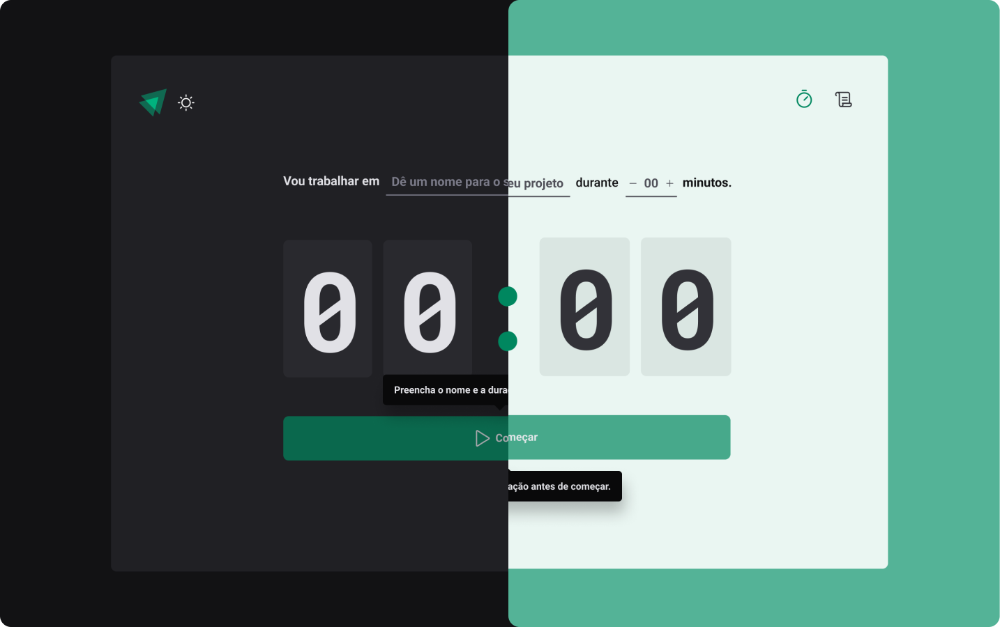

# Timer



## Sobre

Um timer estilo pomodoro para ajudar o usuário a se concentrar em qualquer tarefa do dia a dia, o usuário preenche uma tarefa e o tempo de duração e inicia um novo ciclo simples assim, o usuário consegue acompanhar o histórico de ciclos completos, em andamento e interrompidos.

## Instalação

```bash title="Clone o repositório"
git clone https://github.com/manoguii/timer.git
```

- Para rodar o projeto localmente
  1. Instale as dependências ```npm install```
  2. Execute a aplicação. ```npm run dev```
  3. Acesse `http://localhost:3000`

## Tecnologias

Algumas tecnologias utilizadas para construção da aplicação.

- [ReactJS](https://reactjs.org/)
- [TypeScript](https://www.typescriptlang.org/)
- [Styled Components](https://styled-components.com/)
- [React Hook Form](https://www.react-hook-form.com/)
- [Zod](https://zod.dev/)

---

<center>Made with 💙 by Guilherme David</center>
